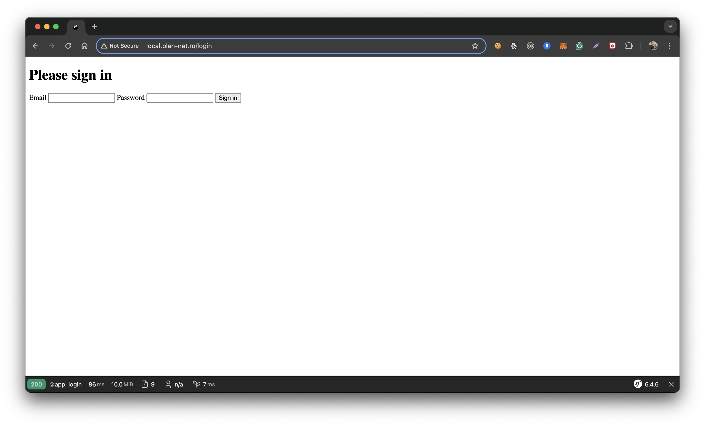
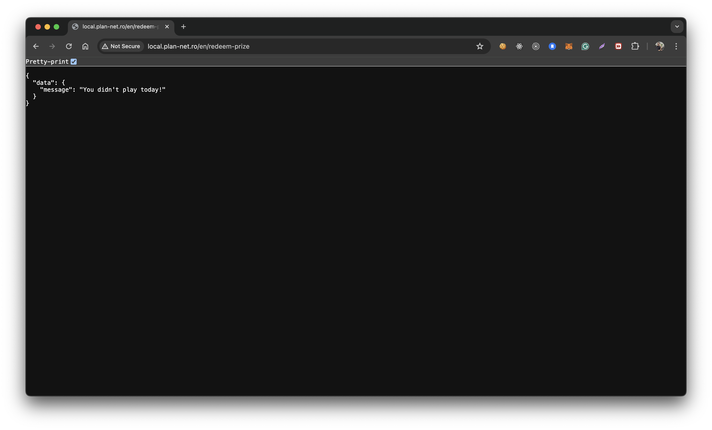
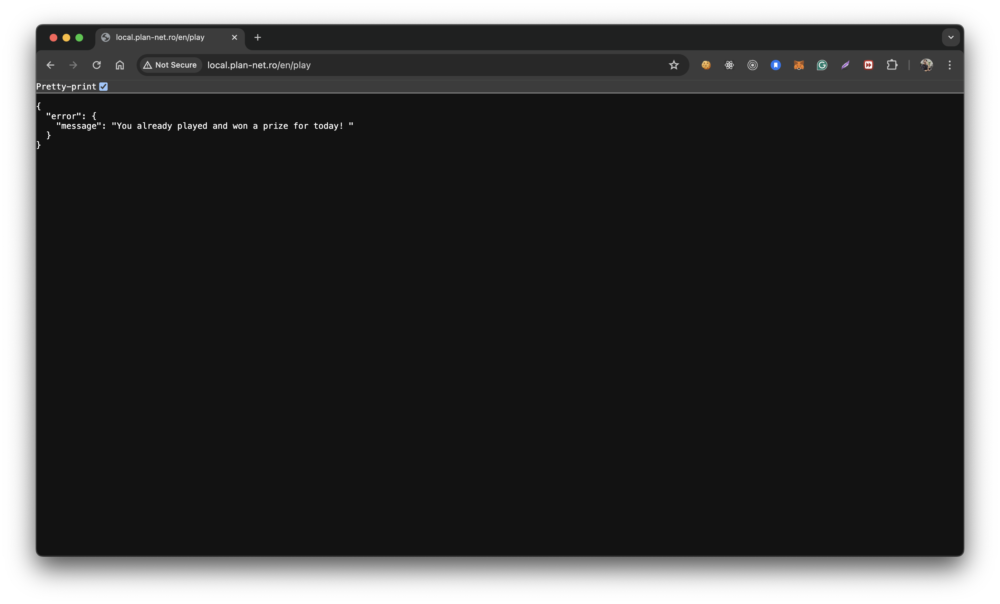
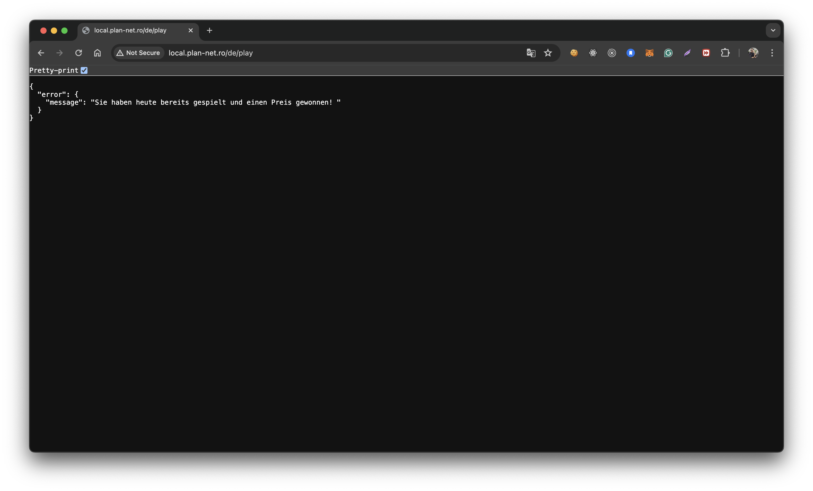
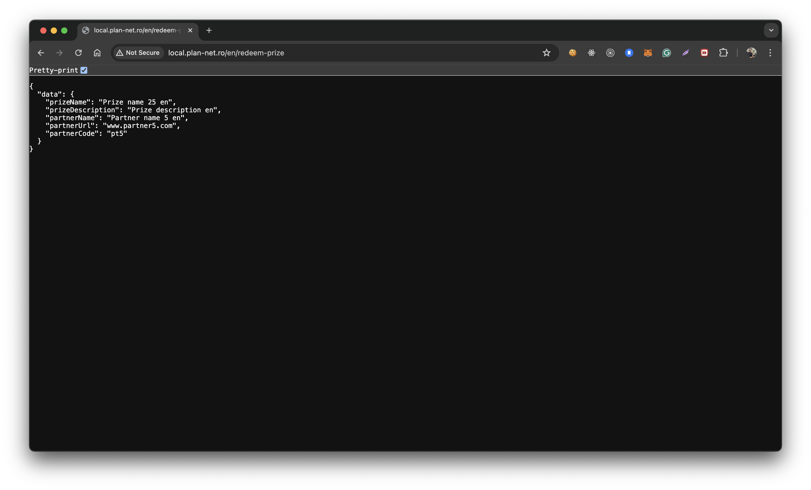
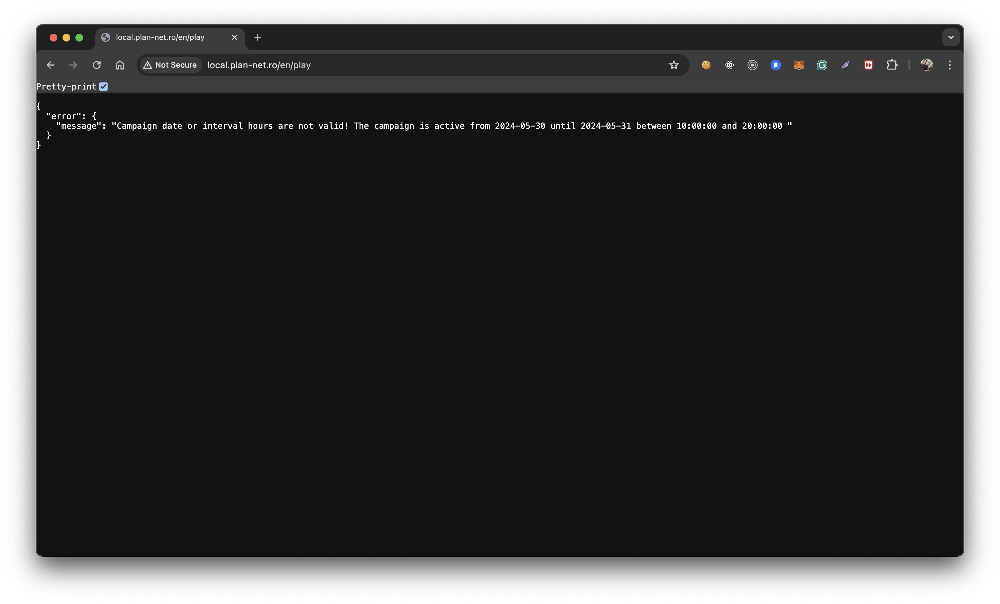
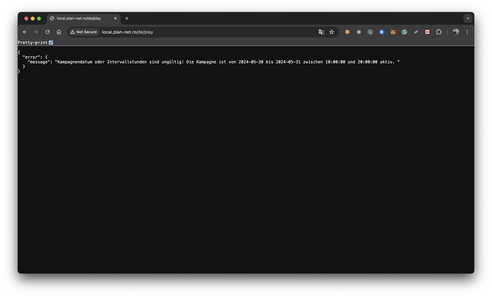

Plan-net Assignment project

This recipe was tested on Docker Desktop 4.30.0
==============================================================================

Description
-----------------
Brings up a Linux Containers with Docker, which configures
and installs everything from mysql to php (and php modules), apache and so on.
For more info see docker-compose.yml

Requirements
------------

1. Install [Docker](docker.io)

Setup instructions for Docker environment
-----------------

1. Archive the project plan-net-assignment
2. cd docker
3. Run ``docker-compose up --build -d``
4. Run ``docker exec -it plan-net /bin/bash``
5. Go to ``cd /var/www/plan-net/``
6. RUN ``composer install``
7. RUN ``bin/console doctrine:migrations:migrate`` in order to create the tables
8. RUN ``bin/console app:import-partners en`` - importing the partners en CSV file
9. RUN ``bin/console app:import-partners de`` - importing the partners de CSV file
10. RUN ``bin/console app:import-prizes en`` - importing the prizes en CSV file
11. RUN ``bin/console app:import-prizes de`` - importing the prizes de CSV file
12. RUN ``bin/console doctrine:fixtures:load`` - creating the users in user table
13. RUN ``bin/console messenger:consume async`` - running the consumer who consume the above messages
- You can configure domain names by editing ``/etc/hosts`` on the host and putting the IP and domain names desired, such as:
##
# Host Database
# localhost is used to configure the loopback interface
# when the system is booting.  Do not change this entry.
##
127.0.0.1       localhost
255.255.255.0   broadcasthost
::1             localhost

10.254.254.0 local.plan-net.ro plan-net.mysql

RUN ``sudo ifconfig lo0 alias 10.254.254.0``

Presentation
------------
Login Page

The password for each user is the "demo" string concatenated with the userId. Eg: demo4. Please see plan-net/src/DataFixtures/UserFixtures.php:36

http://local.plan-net.ro/de/redeem-prize

http://local.plan-net.ro/en/play

http://local.plan-net.ro/en/play

http://local.plan-net.ro/de/play (translated)

http://local.plan-net.ro/en/redeem-prize

http://local.plan-net.ro/de/redeem-prize (translated)

http://local.plan-net.ro/en/play (I changed the starting hour a little bit to make this screenshot)

http://local.plan-net.ro/de/play (translated)
